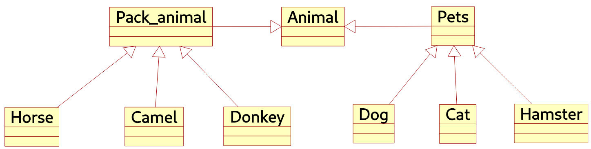

# Итоговая работа по блоку специализация
Результат выполнения заданий распольожен в директориях:

## Задание 1
Используя команду cat в терминале операционной системы Linux, создать
два файла Домашние животные (заполнив файл собаками, кошками,
хомяками) и Вьючные животными заполнив файл Лошадьми, верблюдами и
ослы), а затем объединить их. Просмотреть содержимое созданного файла.
Переименовать файл, дав ему новое имя (Друзья человека).

## Задание 2
Создать директорию, переместить файл туда.

## Задание 3
Подключить дополнительный репозиторий MySQL. Установить любой пакет
из этого репозитория.

## Задание 4
Установить и удалить deb-пакет с помощью dpkg.

## Задание 5
Выложить историю команд в терминале ubuntu (debian)


## Задание 6
Нарисовать диаграмму, в которой есть класс родительский класс, домашние животные и вьючные животные, в составы которых в случае домашних животных войдут классы: собаки, кошки, хомяки, а в класс вьючные животные войдут: Лошади, верблюды и ослы).


## Задание 7
[task_7-12.sql](./task_7-12.sql)  
В подключенном MySQL репозитории создать базу данных “Друзья человека”.


## Задание 8
[task_7-12.sql](./task_7-12.sql)  
Создать таблицы с иерархией из диаграммы в БД.


## Задание 9
[task_7-12.sql](./task_7-12.sql)  
Заполнить низкоуровневые таблицы именами(животных), командами которые они выполняют и датами рождения.  
### Пример:


## Задание 10
[task_7-12.sql](./task_7-12.sql)  
Удалить из таблицы верблюдов, т.к. верблюдов решили перевезти в другой питомник на зимовку. Объединить таблицы лошади, и ослы в одну таблицу.
```sql
DELETE * FROM Camel;
```

```sql
DROP TABLE IF EXISTS Artiodactyl;
CREATE TABLE Artiodactyl (
	SELECT * FROM Hourse
	UNION
	SELECT * FROM Donkey
);

SET @id = 0;
UPDATE Artiodactyl SET
  id = (SELECT @id := @id + 1);
ALTER TABLE Artiodactyl MODIFY COLUMN id SERIAL;
ALTER TABLE Artiodactyl ADD FOREIGN KEY (id_Pack_animal) REFERENCES Pack_animal(Id);
```


## Задание 11
[task_7-12.sql](./task_7-12.sql)  
Создать новую таблицу “молодые животные” в которую попадут все животные старше 1 года, но младше 3 лет и в отдельном столбце с точностью до месяца подсчитать возраст животных в новой таблице.
```sql
-- ЗАДАНИЕ 11 --

DROP TABLE IF EXISTS all_pets;
CREATE TABLE all_pets( 
	SELECT * FROM Cat
	UNION
	SELECT * FROM Dog
	UNION
	SELECT * FROM Hamster
);
-- ALTER TABLE all_pets ADD COLUMN id_Pack_animal BIGINT UNSIGNED;

DROP TABLE IF EXISTS all_pack;
CREATE TABLE all_pack( 
	SELECT * FROM Donkey
	UNION
	SELECT * FROM Horse
	UNION
	SELECT * FROM Camel
);
-- ALTER TABLE all_pack ADD COLUMN id_Pet BIGINT UNSIGNED;

DROP TABLE IF EXISTS all_animals;
CREATE TABLE all_animals (
	SELECT * FROM all_pets
	UNION
	SELECT * FROM all_pack
);

DROP TABLE IF EXISTS young_animal;
CREATE TABLE young_animal (
	SELECT
		*,
		TIMESTAMPDIFF(MONTH, all_animals.birthday, NOW()) AS "how_old(month)"
	FROM all_animals WHERE TIMESTAMPDIFF(YEAR, all_animals.birthday, NOW()) >= 1 AND TIMESTAMPDIFF(YEAR, all_animals.birthday, NOW()) < 4 
);

DROP TABLE IF EXISTS all_pets;
DROP TABLE IF EXISTS all_pack;
DROP TABLE IF EXISTS all_animals;

SET @id = 0;
UPDATE young_animal SET
  id = (SELECT @id := @id + 1);
ALTER TABLE young_animal MODIFY COLUMN id SERIAL;
-- SELECT * FROM young_animal;

```

## Задание 12
[task_7-12.sql](./task_7-12.sql)  
Объединить все таблицы в одну, при этом сохраняя поля, указывающие на прошлую принадлежность к старым таблицам.
```sql
-- ЗАДАНИЕ 12 --

DROP TABLE IF EXISTS all_Pets;
CREATE TABLE all_Pets (
	SELECT * FROM Cat
	UNION
	SELECT * FROM Dog
	UNION
	SELECT * FROM Hamster
);
ALTER TABLE all_Pets DROP id;
-- SELECT * FROM all_Pets;

DROP TABLE IF EXISTS all_Pets_with_type;
CREATE TABLE all_Pets_with_type (
	SELECT * FROM all_Pets LEFT JOIN Pet ON all_Pets.id_Pet = Pet.id
);
ALTER TABLE all_Pets_with_type DROP id;
-- SELECT * FROM all_Pets_with_type;


DROP TABLE IF EXISTS all_Pack_animal;
CREATE TABLE all_Pack_animal (
	SELECT * FROM Camel
	UNION
	SELECT * FROM Donkey
	UNION
	SELECT * FROM Horse
);
ALTER TABLE all_Pack_animal DROP id;
-- SELECT * FROM all_Pack_animal;

DROP TABLE IF EXISTS all_Pack_animal_with_type;
CREATE TABLE all_Pack_animal_with_type (
	SELECT * FROM all_Pack_animal LEFT JOIN Pack_animal ON all_Pack_animal.id_Pack_animal = Pack_animal.id
);
ALTER TABLE all_Pack_animal_with_type DROP id;
-- SELECT * FROM all_Pack_animal_with_type;


DROP TABLE IF EXISTS all_animals;
CREATE TABLE all_animals(
	SELECT * FROM Animal
		LEFT JOIN all_Pack_animal_with_type ON all_Pack_animal_with_type.id_Animal = Animal.id
	UNION
	SELECT * FROM Animal
		LEFT JOIN all_Pets_with_type ON all_Pets_with_type.id_Animal = Animal.id
);

DROP TABLE IF EXISTS all_Pets;
DROP TABLE IF EXISTS all_Pets_with_type;
DROP TABLE IF EXISTS all_Pack_animal;
DROP TABLE IF EXISTS all_Pack_animal_with_type;

SET @id = 0;
UPDATE all_animals SET
  id = (SELECT @id := @id + 1);
ALTER TABLE all_animals MODIFY COLUMN id SERIAL;
-- SELECT * FROM all_animals;
```


## Задание 13
Создать класс с Инкапсуляцией методов и наследованием по диаграмме.

## Задание 14
Написать программу, имитирующую работу реестра домашних животных.

## Задание 14.1
Завести новое животное.

## Задание 14.2
Определять животное в правильный класс.

## Задание 14.3
Увидеть список команд, которое выполняет животное.

## Задание 14.4
Обучить животное новым командам.

## Задание 14.5
Реализовать навигацию по меню.

## Задание 15
Создайте класс Счетчик, у которого есть метод add(), увеличивающий̆ значение внутренней̆ int переменной̆ на 1 при нажатие “Завести новое животное” Сделайте так, чтобы с объектом такого типа можно было работать в блоке try-with-resources. Нужно бросить исключение, если работа с объектом типа счетчик была не в ресурсном try и/или ресурс остался открыт. Значение считать в ресурсе try, если при заведения животного заполнены все поля.
